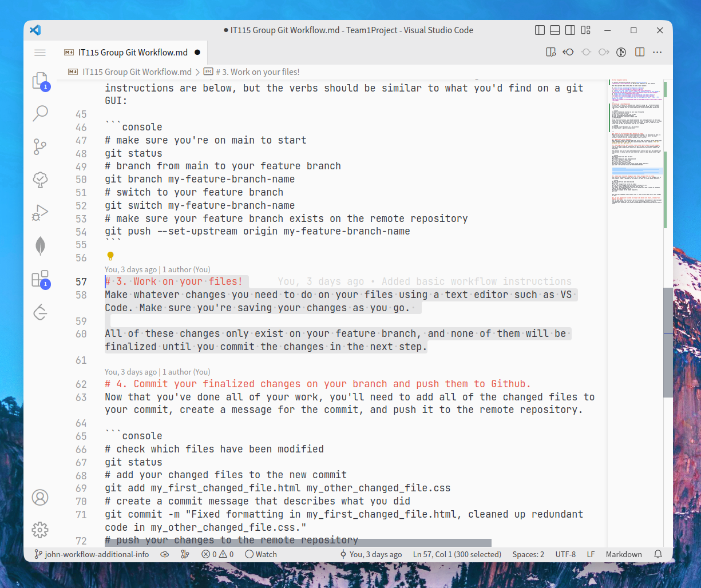
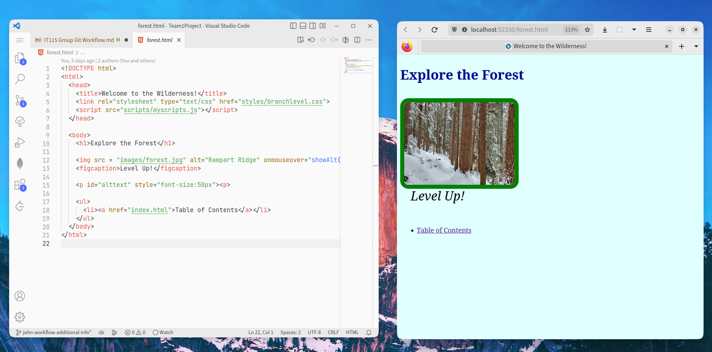

# IT115 Group Git Workflow

If you are just getting started, follow [these instructions](#setting-up-a-local-repository) to get a local repository on your machine.

Use this approach when sitting down to work on your project:

- [IT115 Group Git Workflow](#it115-group-git-workflow)
- [Setting up A Local Repository](#setting-up-a-local-repository)
- [0. Check for any outstanding Pull Requests on Github.](#0-check-for-any-outstanding-pull-requests-on-github)
- [1. Update your local repository.](#1-update-your-local-repository)
- [2. Starting from the "main" branch, create a new feature branch for your changes.](#2-starting-from-the-main-branch-create-a-new-feature-branch-for-your-changes)
- [3. Work on your files!](#3-work-on-your-files)
- [4. Commit your finalized changes on your branch and push them to Github.](#4-commit-your-finalized-changes-on-your-branch-and-push-them-to-github)
- [5. If your changes are finished and ready to be merged into "main", create a Pull Request on Github.](#5-if-your-changes-are-finished-and-ready-to-be-merged-into-main-create-a-pull-request-on-github)

# Setting up A Local Repository
I have found it easiest to setup a local repository using `gh`, the Github command line tool. While the same functionality can be achieved by using `git`, I've found that certain commands such as cloning and syncing are a little simpler while using `gh`.

```console
# move to the desired location on your local filesystem
cd path/to/my/chosen/location
# using 'gh', clone the repo from `origin`
gh repo clone kdpcapstone/Team1Project
# enter the project directory to begin work
cd Team1Project 
```
Using these instructions, you should have moved your working directory to where you wanted the local repository to exist before you cloned it to your machine. If for some reason you cloned it into a directory that isn't where you want to keep your local files, you can move the directory with the `mv` command:

```console
# move the project directory to a new location
mv Team1Project ../path/to/new/directory
```

# 0. Check for any outstanding Pull Requests on Github.
Make sure we're not waiting to finalize anyone's changes - if there are any that are ready to be merged in, you'll want to make sure that they are before you start working. This will help us avoid a redundant labor scenario.

# 1. Update your local repository.
Now that we're ready to sit down and work, you'll need to grab all of the changes that other teammates might have made while you were away from your computer. **For our purposes, just do a `git pull`.**

# 2. Starting from the "main" branch, create a new feature branch for your changes.
This is the one of the big reasons you use git - we want to avoid making changes to the master copy of the project until we're absolutely sure our work is ready to be finalized.

Use whatever tool you're most comfortable with to interact with git. The command-line instructions are below, but the verbs should be similar to what you'd find on a git GUI:

```console
# make sure you're on main to start
git status 
# branch from main to your feature branch
git branch my-feature-branch-name
# switch to your feature branch
git switch my-feature-branch-name
# make sure your feature branch exists on the remote repository
git push --set-upstream origin my-feature-branch-name
```

# 3. Work on your files!
Make whatever changes you need to do on your files using a text editor such as VS Code. Make sure you're saving your changes as you go. 



All of these changes only exist on your feature branch, and none of them will be finalized until you commit the changes in the next step.

As you are working, **be sure to preview the changes in a browser as you make them.** This ensures that your changes are having the desired results.



Additional testing layers may be added via Github actions as our project grows more complex. These will be further documented as they are added.

# 4. Commit your finalized changes on your branch and push them to Github.
Now that you've done all of your work, you'll need to add all of the changed files to your commit, create a message for the commit, and push it to the remote repository.

```console
# check which files have been modified
git status
# add your changed files to the new commit
git add my_first_changed_file.html my_other_changed_file.css
# create a commit message that describes what you did
git commit -m "Fixed formatting in my_first_changed_file.html, cleaned up redundant code in my_other_changed_file.css."
# push your changes to the remote repository
git push
```

Now when your teammates start back at step 1, they will pull down all of your changes as well.

# 5. If your changes are finished and ready to be merged into "main", create a Pull Request on Github.
Use the same method that we used in earlier assignments. Add comments to describe what your proposed changes will do, as well as any outstanding issues or concerns. Teammates will check and confirm any outstanding pull requests before they sit down to work.
