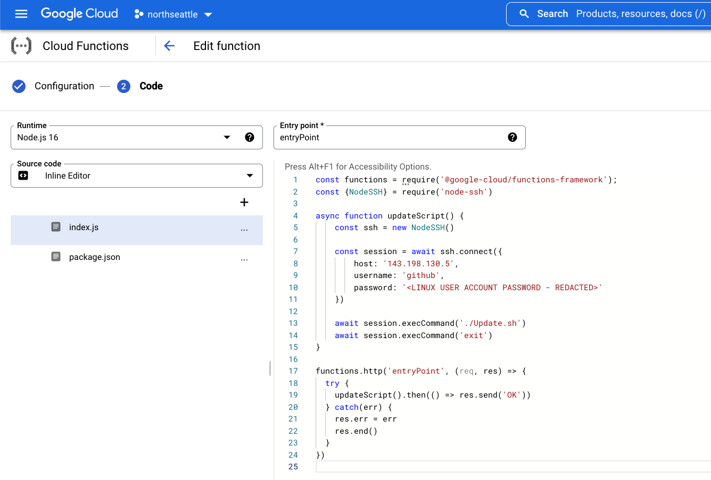
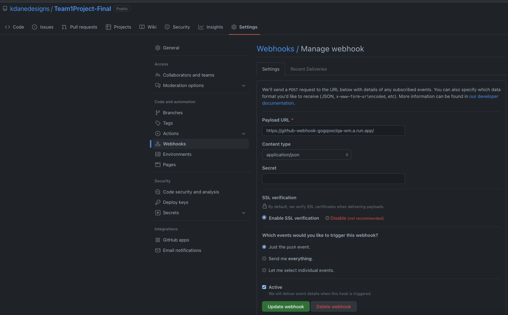

# Server Deployment

## Manual
1. SSH directly into the server: `ssh github@143.198.130.5`
2. Go to the relevant directory: `cd /home/github/live/Team1Project-Final`
3. Open a file in the nano editor: `nano html/index.html`

## Semi-Automated
This will deploy any changes pushed to Github after you run just one local command.
1. Create a [bash script](../server/Update.sh) on the server to run the relevant git commands.
2. Execute `ssh github@143.198.130.5 -t "./Update.sh"` to invoke the script.
3. It will prompt you for the password; enter the previously supplied password for the Linux user "github".

## Fully Automated
This will automatically put and changes pushed to github onto the server immediately, with no addtional interaction required.
1. Create a bash script on the server to run the relevant git commands (reuse the one from the previos section).
2. Create a Google Cloud Function that creates an SSH connection and runs the bash script. 
4. Create a Github webhook that automatically invokes this Google Cloud Function every time a push event is generated by sending a POST request to the URL that Google generates for you. 
